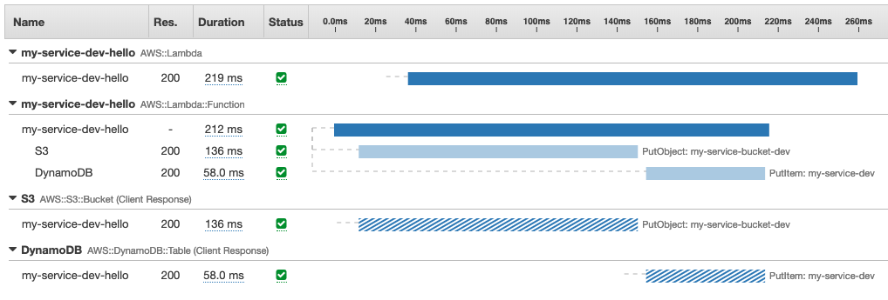

# Serverless Zen

A [serverless](https://serverless.com) starter project focusing on uncompromising local development experience without serverless fatigue.

✅ Typescript  
✅ Zeroconfig ESLint + Airbnb + Prettier via [zeroconf-typescript-eslint](https://github.com/jondot/zeroconf-typescript-eslint)  
✅ Webpack  
✅ Offline: serverless, S3, DynamoDB, Kinesis  
✅ Production and offline resource management via [Terraform](https://terraform.io)  
✅ Lightweight and performant Routing + Handling APIs via [lambda-api](https://github.com/jeremydaly/lambda-api)    
✅ Tracing with XRay   
✅ Keeps a Hot Lambda   
✅ Testing with [Jest](https://jestjs.io/)  


<hr />


<!-- START doctoc generated TOC please keep comment here to allow auto update -->
<!-- DON'T EDIT THIS SECTION, INSTEAD RE-RUN doctoc TO UPDATE -->


- [Serverless Zen](#serverless-zen)
  - [Quick Start](#quick-start)
    - [Make It Your Own](#make-it-your-own)
  - [General Workflow](#general-workflow)
  - [Required Tools](#required-tools)
  - [Working Offline](#working-offline)
    - [S3](#s3)
    - [DynamoDB](#dynamodb)
    - [Kinesis (Beta)](#kinesis-beta)
  - [Testing](#testing)
  - [Routing and Handling](#routing-and-handling)
  - [Keeping a Hot Function](#keeping-a-hot-function)
  - [AWS Services](#aws-services)
    - [Tracing](#tracing)
  - [Infrastructure and Resource Management](#infrastructure-and-resource-management)
    - [Defining Names](#defining-names)
    - [Creating Infrastructure](#creating-infrastructure)
    - [Managing Infrastructure](#managing-infrastructure)
  - [Contributing](#contributing)
    - [Thanks](#thanks)
  - [Copyright](#copyright)

<!-- END doctoc generated TOC please keep comment here to allow auto update -->

## Quick Start

First see [Required Tools](#required-tools).

Here's how to start in offline mode:

```
$ yarn aws-local
(open new terminal)
$ cd tf/dev
$ terraform init && terraform apply
$ cd ../..
$ yarn t
```

You should now have tests passing full integration, with all AWS resources provisioned in your local AWS environment.

To start your service in offline mode:

```
$ yarn s
```

Here's how to start using AWS (note these will use your **real** AWS account).

This sets up your AWS resources, and deploys a real lambda:

```
$ cd tf/prod
$ terraform init && terraform apply
$ cd ../..
$ yarn d
```

### Make It Your Own

Run `whats-to-rename.sh` to see how to rename this starter service and make it your own. This script uses [the silver searcher](https://github.com/ggreer/the_silver_searcher).


## General Workflow

Usually you want to run `yarn s` and `yarn aws-local` for your local development.

* `yarn s` - start local development
* `yarn aws-local` - start all local AWS services
* `yarn t` - test with Jest
* `yarn b` - build and profile webpack bundle
* `yarn d` - deploy to dev

## Required Tools

Make sure you have the following tools set up in your path:

* [docker](https://www.docker.com/)
* [aws-cli](https://aws.amazon.com/cli/)
* [minio](https://minio.io/)
* [terraform](https://terraform.io)
* [the silver searcher](https://github.com/ggreer/the_silver_searcher)


## Working Offline

To allow for a complete and fast development experience we use a few more plugins and workflow tweaks in addition to `serverless-offline`.

To start all of the AWS local services:

```
$ yarn aws-local
```

To use local services from your code:

```js
const { S3, DynamoDB } = createAWS({
  local: true // or: !!process.env.IS_OFFLINE
})
```

### S3

We use [`minio`](https://github.com/minio/minio) for a local, S3-compatible service. It features a first-class management UI and is itself a robust service,
and so gives you a stable and immersive development experience.

To install `minio`:

```
$ brew install minio/stable/minio
```

This service is started as part of `yarn aws-local`. If you want to start it individually:

```
$ yarn aws-local:s3
```

### DynamoDB

We use the official [DynamoDB local](https://docs.aws.amazon.com/amazondynamodb/latest/developerguide/DynamoDBLocal.html) distribution from AWS, and to promote consistency of the service and data we only use it through Docker.


```js

```
This service is started as part of `yarn aws-local`. If you want to start it individually:

```
$ yarn aws-local:dynamodb
```

There's a shortcut command to check out items in DynamoDB:

```
$ yarn dynamodb-local:items
```

### Kinesis (Beta)

We use [kinesalite](https://github.com/mhart/kinesalite) to emulate Kinesis.

This service is started as part of `yarn aws-local`. If you want to start it individually:

```
$ yarn aws-local:kinesis
```

Currently we're not sure emulating Kinesis gives the best development exprience and so, it's there, but we don't use it. We're accepting pull requests that showcase a full and easy Kinesis local workflow.


## Testing

Testing is done with [Jest](https://jestjs.io/). To execute:

```
$ yarn jest
```


## Routing and Handling

Routing and handling looks similar to [Express](https://expressjs.com/) / [Koa](https://koajs.com/) but it's based on neither. To keep the hot path of a request lightweight we use [lambda-api](https://github.com/jeremydaly/lambda-api), which is a minimal layer on top of AWS Lamda API.

[lambda-api](https://github.com/jeremydaly/lambda-api) supports bot middleware and routing:

```js
api.use(keephot)
api.get(
  '/hello',
  async (_req?: Request, res?: Response, _next?: NextFunction) => {
    try {
      await S3.putObject({
        Bucket: process.env.BUCKET,
        ...
```

This strikes a tradeoff of wanting to create a slim, minimal, low-overhead function while having a way of moving from Express or out of Serverless should you want to by adhering to a similar looking API.

While wrapping an Express app with [aws-serverless-express](https://github.com/awslabs/aws-serverless-express) seems trivial, it also plugs in a fairly large codebase in the hot path of every request for your function, not to mention the awkwardness of Express supporting async/await.


## Keeping a Hot Function

You can have a scheduled event that keeps your function hot. To use it, make sure you have the following for your handlers:

1. Add the `keephot` middleware
2. Add a scheduled event to your `serverless.yaml`


## AWS Services

To get added features on top of the regular AWS SDK, use `createAWS`:


```js
import createAWS from './aws'
const { S3, DynamoDB } = createAWS({
  ...
})
```

### Tracing
You can enable or disable tracing with [XRay](https://console.aws.amazon.com/xray/home) using the `createAWS` helper:

```js
import createAWS from './aws'
const { S3, DynamoDB } = createAWS({
  tracing: true,
  local: !!process.env.IS_OFFLINE
})
```

Using the custom built `S3` and `DynamoDB`, you'll get something like this:




## Infrastructure and Resource Management

### Defining Names

Use your `provider.environment` section to set how you want to name your S3 buckets, DynamoDB tables and so on:

```yaml
provider:
  environment:
    DYNAMODB_TABLE: ${self:service}-${opt:stage, self:provider.stage}
    BUCKET: ${self:service}-bucket-${opt:stage, self:provider.stage}
```

Using these from your code is simple:

```js
await S3.putObject({
    Bucket: process.env.BUCKET,
    ...
})
```


### Creating Infrastructure

Infrastructure management (or configuration management), as a best practice, is done with [Terraform](https://terraform.io) -- outside of the serverless framework.

Edit your resources in the `tf/modules/shared` folder:

```
tf/
  prod/
    main.tf         -- production entry point
  dev/
    main.tf         -- development entry point
  modules/
    shared/
      main.tf       -- your infra
      variables.tf
```

Remember to use the same names you've given in your `process.environment` section in your `serverless.yml` file.


You can now use:

```
yarn tf:dev         # see what's planned, does not do anything
yarn tf:dev:apply!  # actually creates resources

yarn tf:prod         # see what's planned, does not do anything
yarn tf:prod:apply!  # actually creates resources
```

You might need to `terraform init` in each of the `prod` and `dev` folders. It'll be a one time thing.


### Managing Infrastructure


When you're adding resources, make sure you add the required IAM permissions and roles in your `serverless.yml`, for example, for S3:

```yaml
- Effect: Allow
    Action:
    - s3:PutObject
    - s3:GetObject
    Resource: "arn:aws:s3:::${self:provider.environment.BUCKET}/*"
```

You can manage these permissions in your Terraform infrastructure folder instead and keep your `serverless.yml` file clean of any infrastructure concerns.

Here too, you need to use the same names you've given in your `process.environment` section in your `serverless.yml` file.


## Contributing

Fork, implement, add tests, pull request, get my everlasting thanks and a respectable place here :).

### Thanks

To all [Contributors](https://github.com/jondot/serverless-zen/graphs/contributors) - you make this happen, thanks!

## Copyright

Copyright (c) 2018 [Dotan Nahum](https://github.com/jondot) [@jondot](http://twitter.com/jondot). See [LICENSE](LICENSE.txt) for further details.